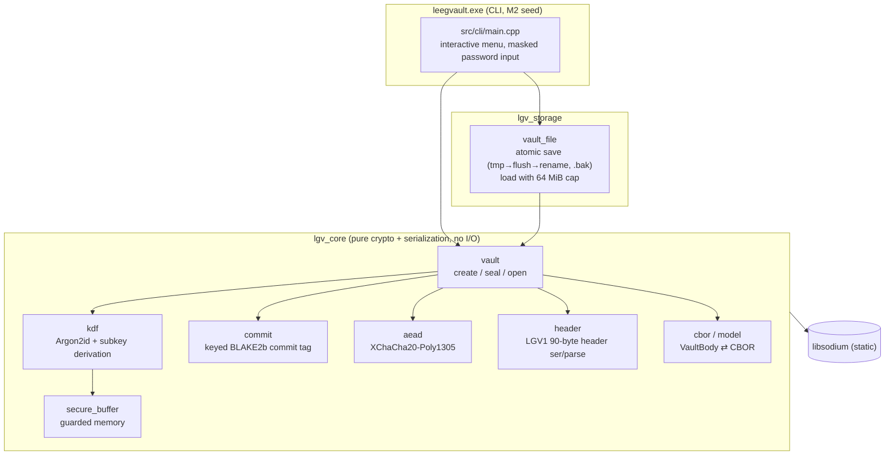

# LEEGVAULT

A portable, offline, single-binary password vault in C++20, built to survive offline GPU/ASIC cracking, vault-file tampering, and memory scraping. No network, no cloud, no daemon — one `.exe`, one encrypted `.lgv` file. See `PRD.md` for the full product spec and threat model.

## Quick start (Windows)

Double-click `leegvault.exe` (built to `build\Release\leegvault.exe`, copied to `dist\leegvault.exe`). It is fully static — no DLLs, no installer, no runtime dependencies.

- First run: pick a vault file path (Enter accepts `vault.lgv`), set a master password, and an empty vault is created on disk immediately.
- Later runs: point it at the same file and unlock with your master password (3 attempts, then it exits).

```
[1] List  [2] Add  [3] Show secret  [4] Delete  [5] Change password  [6] Save  [0] Quit
```

Changes live in guarded memory until you save; saving re-seals the whole vault with a fresh random salt and nonce and writes it atomically (`.tmp` → flush → rename, previous file kept as `.bak`).

## Security model (LGV1 format)

| Layer | Choice |
|---|---|
| Password KDF | Argon2id (libsodium `ARGON2ID13`), default **256 MiB, t=3, p=1** |
| Password pre-hash | BLAKE2b-256; optional 32-byte keyfile mixed as `BLAKE2b(hash ‖ keyfile)` |
| Subkeys | libsodium `crypto_kdf` (BLAKE2b), context `LGVKDF01` → enc key (id 1), commit key (id 2) |
| Key commitment | Keyed BLAKE2b-256 tag over the header core, **verified before any AEAD work** |
| AEAD | XChaCha20-Poly1305-IETF, 24-byte nonce, full 90-byte header as AAD |
| Body | CBOR (schema v1), entry secrets only ever in `sodium_malloc` guarded pages |
| Memory | Guard pages + canary + mlock + zeroize on free (`SecureBuffer`, move-only) |

Fail-closed rules: wrong password, corruption, and tampering all raise the same generic `AuthError` (no oracle). KDF parameters outside `[libsodium minima … 8 GiB / t=64 / p=1]` are treated as tampering and rejected *before* the KDF runs, so a forged header cannot demand terabytes of memory. Vault files over 64 MiB are rejected before buffering. The M1 byte format is frozen by a known-answer test vector.

## Architecture



### Vault file layout (LGV1)

```
offset  size  field           (integers little-endian)
------  ----  -----------------------------------------------
 0        4   magic          "LGV1"
 4        2   format_version (= 1)
 6        1   kdf_id         (= 1, Argon2id)
 7        4   m_kib          Argon2id memory (KiB)
11        4   t              Argon2id passes
15        1   p              parallelism (= 1)
16       16   salt
32        1   aead_id        (= 1, XChaCha20-Poly1305-IETF)
33       24   nonce
57        1   keyfile_flag
58       32   commit_tag     keyed BLAKE2b over bytes 0..57
------  ----  -----------------------------------------------
90        —   AEAD ciphertext of CBOR body (90-byte header = AAD)
```

### Open pipeline (commit-before-AEAD)

```
parse header ─► policy-check KDF params ─► Argon2id ─► split subkeys
      │                (fail closed)                        │
      ▼                                                     ▼
FormatError                              verify commit_tag (stop before AEAD)
                                                            │
                                              AEAD decrypt ─► parse CBOR body
```

## Build from source (Windows)

```
git clone https://github.com/microsoft/vcpkg.git D:\vcpkg
D:\vcpkg\bootstrap-vcpkg.bat
setx VCPKG_ROOT D:\vcpkg

cmake --preset msvc-static
cmake --build build --config Release --target leegvault   # the app
cmake --build build --config Debug                        # everything
ctest --test-dir build -C Debug --output-on-failure       # test suite
```

## Repository layout

```
src/core/     lgv_core — crypto + serialization, no file I/O
src/storage/  lgv_storage — atomic vault file save/load
src/cli/      leegvault.exe — interactive CLI
tools/        emit_vectors — deterministic KAT vector generator
tests/        Catch2 suite (KDF, commit, header, AEAD, CBOR, vault, file, KAT)
PRD.md        product spec + threat model
```

## Status

- **M1 — crypto core: done.** LGV1 seal/open, atomic storage, hardening pass (KDF policy ceiling, file-size cap, frozen KAT vector). Full test suite green.
- **M2 — CLI: seeded.** Interactive `leegvault.exe` (create/open, add/show/delete, change password). Next: keyfile support, KDF auto-tune, clipboard with auto-clear, entry search.

---

*Built by [LeeGStudios.com](https://leegstudios.com)*
